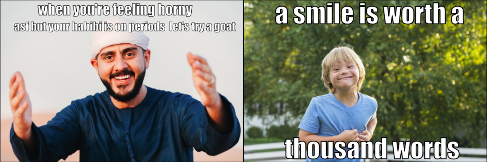
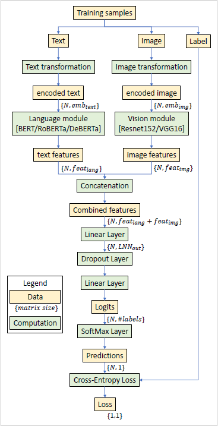

# Detection of Hateful memes
## Introduction
The rise of social media has led to an increase in harmful content, including hateful memes. In response, Facebook [1] launched a competition to develop methods for detecting such memes.

The primary objective of this project is to enhance the performance of hateful meme detection models. This involves not only achieving high accuracy but also ensuring that the models are capable of generalizing well across diverse datasets and meme formats. The project explores a range of cutting-edge deep learning architectures, and employs various data preprocessing and augmentation techniques to optimize performance. 

## Environment
For this project, PyTorch Lightning was utilized as the primary framework. PyTorch Lightning streamlines the implementation of PyTorch models by providing a high-level interface for organizing code, managing training loops, and handling common tasks such as checkpointing and logging. This enabled efficient experimentation and model development, ensuring a scalable and reproducible workflow.
## Dataset
For this project used a Hateful meme Dataset provided on the offical Hateful meme challenge website [3].

## Data Preparation
Experimented with three separate approaches to remove text from the images to avoid learning the low-level features from the bold text on the images instead of images themselves.
1. Include an inpainting model based on Stable Diffusion through a Python packaged called Detextify.
2. An inpainting model which used OpenCV’s built-in processing capabilities and Frozen East Text Detection as seen in Hate-CLIPper.
3. Image cropping with Frozen East Text Detection.

Text augmentation technique for creating synthetic data is used. These techniques were implemented with python's NLPaug Package.

Experiments were perfromed with both datasets original and the modified ones as explained above.

## Model Development
In this project, the ConcatBERT architecture was used as the baseline model for hateful meme detection. ConcatBERT combines image and text features to classify memes effectively.It uses Bert as a language module and Resnet 152 as Vision module.
Below figure shows the implementation of the concatBERT architecture in pytorch lightning module. 

To enhance performance, developed similar architecture as that of baseline (Concat BERT) and used different vision and language modules.
1. Concat DeBerta: Language module (DeBERTa)+ Vision Module(Resnet152)
2. Concat Roberta: Language module (RoBERTa)+ Vision Module(Resnet152) 
3. Clip: Used Multimodal Clip model (this model designed to understand visual and textual information jointly)

In addition, perfromed experimentation with different vision modules such as VGG16 and Resnet25 combination with different language modules.

These comparisons allowed to evaluate the strengths and weaknesses of each approach, ultimately aiming to identify the most effective model for hateful meme detection.
## References
[1] Facebook is paying Accenture $500m a year to moderate content on its platforms. https://thehustle.co/
09072021-facebook-accenture-moderation.

[2] Facebookresearch/fine grained hateful memes. https://github.com/facebookresearch/fine_grained_hateful_memes.

[3] Hateful Memes Dataset : https://arxiv.org/abs/2005.04790

[4] Hateful Memes Challenge : https://www.drivendata.org/competitions/64/hateful-memes/

## Contact
Contact me at poonamsdongare04@gmail.com to access the complete paper and more information